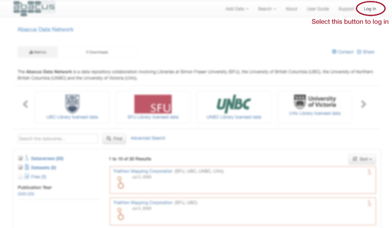
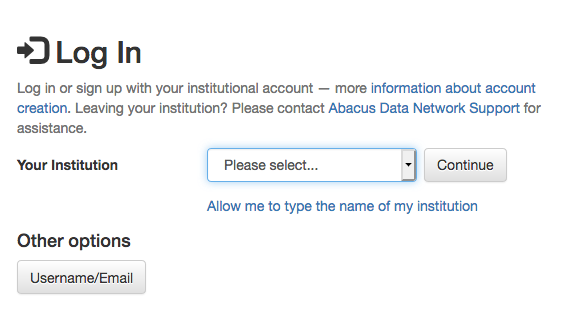
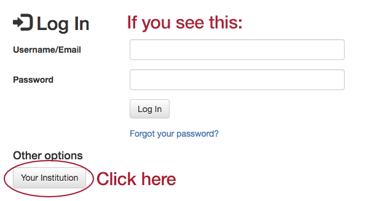
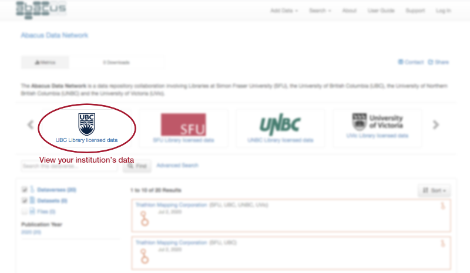

# User guide

While Abacus is designed to be as easy to use as possible, searching for and using data is complex by its very nature. To help you start to navigate Abacus, here are some basic instructions on key activities and functions. If you already know the basics and wish to explore further, please see the [Advanced User's Guide](http://guides.dataverse.org/en/latest).
 
- [Login](#login)
- [Search](#search)
- [Download](#download)
- [Metadata](#metadata)
- [Help/Support](#help)

## <a name='login' />Login

The primary *Abacus* web page is located at <https://abacus.library.ubc.ca>. If you have come directly to this page, as opposed to navigating from your institution's library web site, you will need to **log in**, using the **Log In** link at the extreme right of the menu bar.

By default, you will be presented with a drop down list of the four institutions participating in Abacus. Select your institution from the drop down list and login using the credentials supplied by your university, such as the Campus-wide Login (CWL) used at the University of British Columbia.

If the drop-down list of institutions is not visible and you are being prompted for username/password authentication, you will see **Other options**  underneath the dialogue boxes, with a button labelled **Your Institution**. Clicking on this button will produce the drop-down list as described above.

**It is not necessary to create a username/password for Abacus**. Your institutional login ID is all that is required to access and download files to which your university has access.

## <a name='search' />Search

### Default search
Searching is possible from almost anywhere inside Abacus. From the main page at <https://abacus.library.ubc.ca>, the search feature will search the *entire* contents of Abacus, including material to which your institution may not have access.

To easily limit the material to which your account has access, select your university from the icons at the top of the page.

The general search is a generalized keyword search. You can search for phrases by enclosing them in quotation marks: eg. `"Adult Literacy Survey"`  will find the *International Adult Literacy Survey (IALS)* but not the *Adult Literacy and Life Skills Survey*.  

Should you have too many results, they can limited by selecting the facets on the left side of the page, such as "Publication Year".

Facets may also be discarded once applied by clicking on them after they appear at the top of the search results.

### Advanced search

The **Advanced** search will allow you to search by very specific individual fields, and to **search within the data itself** for applicable data sets. Note that not all data sets have variable level searching implemented, nor does every study in Abacus have every field filled, as some values are not applicable to some types of data sets.

## <a name='download' />Download

Once you've found a data set in the search, click on the title and you'll be taken to its page. By default, you are taken to a short display with an abstract and a listing of files. For each file, you may have several options, depending on its type.

* To quickly download the file, click on the **Download** button

* For statistical files which are available for online analysis, you can view their contents and download in a variety of formats by using the **Explore** button. You will also be able to view summary statistics for these data sets and create cross-tabulations, as well as search within the data set itself at the variable level.

* To see a preview (if available),permanent URL and other metadata for a particular file, click on the **filename**. The next page will provide citations for both the data set and the individual *file*, as well as a record of any changes to the file itself. The metadata tab will also provide a direct download link, and display an md5 checksum should you wish to verify your download.

### Bulk downloads

To download multiple files at once, select the checkbox at the left of the top row of the file table. This will automatically select all of the files in the study. Download the files using **Download** button on the top row of the table. 

For data sets with very large files, such as the geospatial datasets from *DMTI Spatial Inc.* or compilations of lidar or orthoimagery, downloads may be truncated due to size limits on zip files. Other download options are available, such as API based downloads (as per the Advanced User's Guide](http://guides.dataverse.org/en/latest)).

## <a name='metadata' />Metadata

To view the metadata or detailed description of the material in Abacus, select the **Metadata** tab of the data set in which you are viewing. By default, citation metadata is visible, with other sections of metadata (such as Geospatial data) is only visible after clicking on the appropriate button. 

For many social science data sets, much of the metadata will be stored in the *Social Science and Humanities Metadata* section, such as sample information, etc.

Study metadata can be exported in a variety of formats for use in other applications by selecting the format desired from the **Export Metadata** button found just above the citation metadata. Some formats can be used with citation managers, such as DataCite and Dublin Core, but import formats are dependent entirely on the citation manager software.

## <a name='help' />Help/support

For more detailed information beyond this brief guide, please see the [Advanced User's Guide](http://guides.dataverse.org/en/latest), which will give a detailed overview of the use of Dataverse, the software which powers Abacus.

Support within Abacus itself is available as well. For email assistance, use the **Support** link in the interface menu bar.

For support with specific data sets, or to report errors and technical issues, within each record you can use the **Contact** button just above and to the right of the dataset title. Note that in most cases, the **Support** and **Contact** buttons will be sent to the same people, ie *Abacus Support*.

