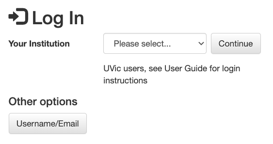
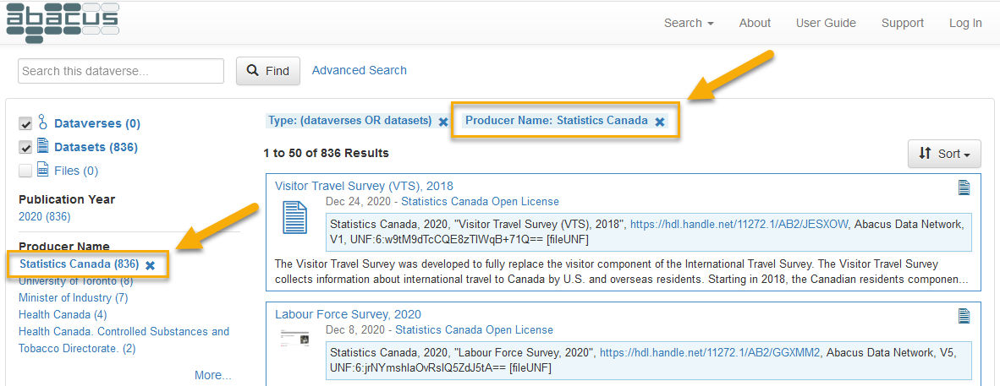

# User guide

While Abacus is designed to be as easy to use as possible, searching for and using data is complex by its very nature. To help you start to navigate Abacus, here are some basic instructions on key activities and functions. If you already know the basics and wish to explore further, please see the [Advanced User's Guide](http://guides.dataverse.org/en/4.20).
 
- [Login](#login)
- [Search](#search)
- [Download](#download)
- [Metadata](#metadata)
- [Help/Support](#help)

## <a name='login' />Login

### Your first login

If you have never logged in to Abacus, when you log in for the **first time** from your institutional web page, you will be taken to the account creation page. Abacus will automatically create an account which uses information provided by your institution.

Verify that your account details are correct (which they should be, as they have come from your institution) and confirm them.

Click on the *Abacus* logo at the top left of the page, and you will be able to use the Abacus service.

**You will only need to perform the above on your very first login**.

The primary *Abacus* web page is located at <https://abacus.library.ubc.ca>. Anyone may search *Abacus* and view the data descriptions but many data files can only be accessed by users affiliated with SFU, UBC, UNBC, or UVic. To work with these licensed files you will need to **log in** with your university credentials. 

If you have come directly to the *Abacus* home page, as opposed to navigating from your institution's library web site, follow these instructions to **log in**:

**UVic users** [login here](https://login.ezproxy.library.uvic.ca/login?url=https://abacus.library.ubc.ca/dataverse/uvic) using your university credentials. After login you will be redirected to the UVic collection in Abacus.

**SFU, UBC, and UNBC users** use the **Log In** link at the extreme right of the top menu bar.

By default, you will be presented with a drop down list showing SFU, UBC, and UNBC. Select your institution and login using the credentials supplied by your university, such as the Campus-wide Login (CWL) used at the University of British Columbia.

If the drop-down list of institutions is not visible and you are being prompted for username/password authentication, you will see **Other options**  underneath the dialogue boxes, with a button labelled **Your Institution**. Clicking on this button will produce the drop-down list as described above.

**It is not necessary to select a username/password for Abacus**, an account will be created for you the first time you login. Your institutional login ID is all that is required to access and download files to which your university has access. See **your first login** above.

## <a name='search' />Search

### Default search
Searching is possible from almost anywhere inside Abacus. From the main page at <https://abacus.library.ubc.ca>, the search feature will search the *entire* contents of Abacus, including material to which your institution may not have access.

To easily limit your search to material to which your account has access, select your university from the icons at the top of the page.

To limit your search to material that is available to the public without login, select the [Abacus Open Data](https://abacus.library.ubc.ca/dataverse/abacus-open) icon.

Should your search produce too many results, it can be narrowed by selecting the facets on the left side of the page, such as "Publication Year".

Facets may also be discarded once applied by clicking on them after they appear at the top of the search results.

### Search syntax tips

The **general search** in Abacus is a generalized keyword search. By default, search terms are connected with the Boolean OR (`||`) operator. Thus, entering `adult literacy survey` into the search field will match material related to "adult", "literacy", or "survey", but not necessarily all three. To do this, use the `AND` operator: `adult AND literacy AND survey` or, alternatively, `adult && literacy && survey`.

**Searching for phrases** is often an effective way to quickly locate data. This is done by enclosing multiple terms in double quotation marks: `"adult literacy"`. While this can be a powerful way to search when you know specifically what you are looking for, it is important to be aware of its potential limitations--namely, it is very restrictive and may incidentally exclude material of interest. For example, a search for `"adult literacy survey"`  will return the *International Adult Literacy Survey (IALS)*, but not the *Adult Literacy and Life Skills Survey*.

> Searching for phrases must be done using *double* quotation marks. Using single quotation marks is equivalent to using *no* quotation marks. Thus, `'income inequality'` produces the same results as `income inequality`: a search for objects containing the term "income" OR the term "inequality".

**Making use of logical operators** will greatly improve search results. In addition to the `AND` and `OR` operators discussed above, other useful Boolean operators include `NOT` (`!`), `+`, and `-`. The `NOT` and `-` operators function similarly, requiring that the term following the operator not be present in search results, while the `+` operator requires that the term is present. For instance, `literacy !child`, or `literacy -child`, will return all results on "literacy" without the term "child", while `+"adult literacy" survey` requires that material be returned containing the phrase "adult literacy", but may or may not contain the term "survey".

> To use Boolean operators in word form (e.g. `AND`, `OR`, `NOT`), all letters must be uppercase. Additionally, when using the `!` operator, unlike its word form `NOT`, do not include a space before the term it applies to--correct: `education !primary`, incorrect: `education ! primary`.

**To escape special characters**, precede them with a backslash (`\`). For example, the syntax for searching for "What is to be done?: Living in a world where 1+1 is !" would be `"What is to be done\?\: Living in a world where 1\+1 is \!"`, since `?`, `:`, `+`, and `!` are all special characters.

For added control over the Boolean logic of a search, users can **group clauses to form sub-queries** using parentheses. Searching for `vaccine AND ("corona virus" OR "COVID-19")` will return material that matches either "vaccine" and "corona virus" or "vaccine" and "COVID-19".

Users can also narrow their search within Abacus by **querying specific fields**. The syntax for this requires, first, specifiying the field to be searched (e.g. `title`), followed by a `:`, and then the term to search for: `title:financialization`. (NOTE: There is no space between the colon and the search term. Including one will run a different search: one for "title" OR "financialization".) Searching for multiple terms within a field requires specifying the field before each term. For example, the sytnax for searching for the terms "financial" and "markets" within the "title" field is `title:financial AND title:markets`. Using the query `title:financial markets` will search for "financial" in the "title" field and "markets" in Abacus' "description" field. To search for the phrase "financial markets" in the "title" field, wrap the phrase in double quotation marks: `title:"financial markets"`.

Abacus supports the use of both single- and multiple-character **wildcards** in its search software. Single-character wildcard searches use the `?` operator. For instance, `?oom` matches "zoom", "room", and "boom", but not "broom". The `?` operator can appear anywhere in a term (beginning, middle, or end). The `*` operator matches zero or more sequential characters in a term. So, `revolution*` matches "revolution", "revolutionary", and "revolutionaries". Like the `?` operator, it can be placed anywhere in a term.

> Wilcard operators function only on terms, not phrases.

**Searching by specifying a date range** can also be an effective way to find data. Dates and times in Abacus are formatted as `YYYY-MM-DDThh:mm:ssZ`, where:
- `YYYY` is the year,
- `MM` is the month,
- `DD` is the day of the month,
- `T` denotes the change from date to time (This always remains constant; it does not require changing.),
- `hh` is the hour of the day using a 24-hour clock (e.g. 1 pm is 13, 10 pm is 22, etc.),
- `mm` is the minutes,
- `ss` is the seconds, and
- `Z` denotes that the time is in Coordinated Universal Time (UTC).

> Since the date format contains colons, which are a special character, escaping is required: `1973-12-22T14\:33\:46Z`. Alternatively, this query can be written without escaping using double quotation marks: `"1973-12-22T14:33:46Z"`. If a date is included within brackets, such as for a date range, then escaping is not required: `[1973-12-22T14:33:46Z TO 1975-11-02T17:39:42Z]`.

Range syntax is denoted in Abacus as `[ TO ]`, where both a lower and upper bound are specified. Different types of brackets indicate whether these bounds are inclusive or exclusive. Square brackets `[]` represent inclusive lower and upper bounds, whereas curly brackets `{}` represent exclusive bounds. These can be combined within a single query: `{1956-02-16 TO 1988-05-03]`. The current time can be represented using the special value `NOW`, while an asterisk `*` represents either the earliest or most recent data deposit, depending on its location within a query. Thus, entering `[* TO 2001-09-11}` would return all matched objects from the earliest in the repository up to (but excluding) 11 September 2001, whereas entering `[2001-09-11 TO *]` would return all matched objects from (and including) 11 September 2001 up to the most recent related deposit.

### Advanced search

The **Advanced** search will allow you to search by very specific individual fields and to **search within the data itself** for applicable datasets. Note that not all datasets have variable-level searching implemented, nor does every study in Abacus have every field filled, as some values are not applicable to some types of datasets.

## <a name='download' />Download

Once you've found a data set in the search, click on the title and you'll be taken to its page. By default, you are taken to a short display with an abstract and a listing of files. For each file, you may have several options, depending on its type.

* To quickly download the file, click on the **Download** button

* For statistical files which are available for online analysis, you can view their contents and download in a variety of formats by using the **Explore** button. You will also be able to view summary statistics for these data sets and create cross-tabulations, as well as search within the data set itself at the variable level.

### Linking and downloading individual files

* To see a preview (if available), permanent URL and other metadata for a particular file, click on the **filename**. The next page will provide citations for both the data set and the individual *file*, as well as a record of any changes to the file itself. The file may be downloaded by clicking the **Download** button. The metadata tab will may also provide a direct download link (if available), and display an md5 checksum should you wish to verify your download.

If there is no direct download link, and programmatic access is required, the using the equivalent of the following `curl` commands will allow direct download.

#### Publicly accessible data files

As an example, the [2020 Labour Force Survey](https://dvn.library.ubc.ca/dataset.xhtml?persistentId=hdl:11272.1/AB2/GGXMM2&version=2.0) data:

File page for the **August 2020 ASCII data**:

`https://dvn.library.ubc.ca/file.xhtml?persistentId=hdl:11272.1/AB2/GGXMM2/KMGN1A&version=2.0`

To download this file:

`curl "https://abacus.library.ubc.ca/api/access/datafile/:persistentId/?persistentId=hdl:11272.1/AB2/GGXMM2/KMGN1A" -o micro2020-08.zip"`

#### Licensed data

To download licensed data, you will need an API token (see the [Advanced User's Guide](http://guides.dataverse.org/en/4.20))

As an example, the [CanMap Content Suite, v2019.3](https://dvn.library.ubc.ca/dataset.xhtml?persistentId=hdl:11272.1/AB2/PCTBFN&version=1.0):

File page for the **WatershedsRegion.zip** file:

`https://dvn.library.ubc.ca/file.xhtml?persistentId=hdl:11272.1/AB2/PCTBFN/IBVPVN&version=1.0`

To download this file:

`curl -H "X-Dataverse-key: YOURAPITOKEN" "https://abacus.library.ubc.ca/api/access/datafile/:persistentId/?persistentId=hdl:11272.1/AB2/PCTBFN/IBVPVN" -o WatershedsRegion.zip`

Where YOURAPITOKEN is your account's API token.

### Bulk downloads

To download multiple files at once, select the checkbox at the left of the top row of the file table. This will automatically select all of the files in the study. Download the files using **Download** button on the top row of the table. 

For data sets with very large files, such as the geospatial datasets from *DMTI Spatial Inc.* or compilations of lidar or orthoimagery, downloads may be truncated due to size limits on zip files. Other download options are available, such as API based downloads (as per the [Advanced User's Guide](http://guides.dataverse.org/en/4.20)).

## <a name='metadata' />Metadata

To view the metadata or detailed description of the material in Abacus, select the **Metadata** tab of the data set in which you are viewing. By default, citation metadata is visible, with other sections of metadata (such as Geospatial data) is only visible after clicking on the appropriate button. 

For many social science data sets, much of the metadata will be stored in the *Social Science and Humanities Metadata* section, such as sample information, etc.

Study metadata can be exported in a variety of formats for use in other applications by selecting the format desired from the **Export Metadata** button found just above the citation metadata. Some formats can be used with citation managers, such as DataCite and Dublin Core, but import formats are dependent entirely on the citation manager software.

## <a name='help' />Help/support

For more detailed information beyond this brief guide, please see the [Advanced User's Guide](http://guides.dataverse.org/en/4.20), which will give a detailed overview of the use of Dataverse, the software which powers Abacus.

Support within Abacus itself is available as well. For email assistance, use the **Support** link in the interface menu bar.

For support with specific data sets, or to report errors and technical issues, within each record you can use the **Contact** button just above and to the right of the dataset title. Note that in most cases, the **Support** and **Contact** buttons will be sent to the same people, ie *Abacus Support*.
