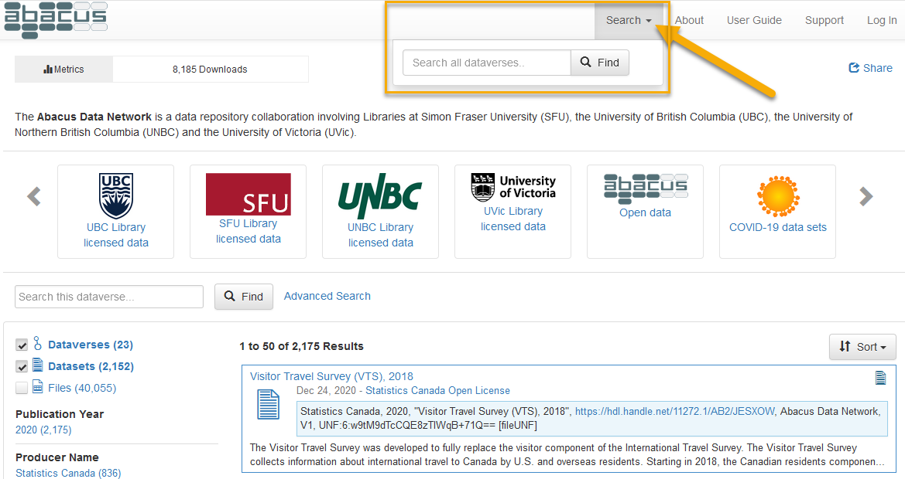

# Search syntax tips

- [Boolean logical operators](#boolean)
- [Search scope](#scope)
- [Querying specific fields](#field) 
- [Specifying a date range](#date) 

## <a name="boolean" />Boolean logical operators
**Boolean logical operators** greatly improve the power and efficiency of queries. By default, search terms are connected with the Boolean `OR` operator. Thus, the search `adult literacy survey` will match material containing "adult", "literacy", or "survey", but not necessarily all three. For results that contain all search terms, use the `AND` operator: `adult AND literacy AND survey`. 

In addition to the `AND` and `OR` operators, other useful Boolean operators include `NOT`, `+`, and `-`. 

The `NOT` and `-` operators function similarly, requiring that the term following the operator not be present in search results, while the `+` operator requires that the term is present. For instance, `literacy NOT child`, or `literacy -child`, will return all results containing "literacy" without the term "child", while `+"adult literacy" survey` returns results with the phrase "adult literacy" that may or may not contain the term "survey".

In addition to their word form, Boolean operators can also be called in symbol form:

Word | Symbol
--- | ---
AND | &&
OR | \|\|
NOT | !

> To use Boolean operators in word form (e.g. `AND`, `OR`, `NOT`), all letters must be uppercase. Additionally, when using the `!` operator, unlike its word form `NOT`, do not include a space before the term it applies to--correct: `education !primary`, incorrect: `education ! primary`.

For added control over the Boolean logic of a search, users can **group clauses to form sub-queries** using parentheses. Searching for `vaccine AND ("corona virus" OR "COVID-19")` will return material that matches either "vaccine" and "corona virus" or "vaccine" and "COVID-19".

## <a name="scope" />Search scope
Abacus supports two distinct **search scopes**: "global" and "local". Using the search box on the left-hand side of the user interface will limit results to the dataverse currently selected (a "local" search), while using the search box through selecting the "Search" drop-down menu at the top of the user interface will execute a query on all dataverses in the Abacus Data Network (a "global" search).

## <a name="field" />Querying specific fields
Users can also narrow their search within Abacus by **querying specific fields**. The syntax for this requires, first, specifiying the field to be searched (e.g. `title`), followed by a `:`, and then the term to search for: `title:financial`. (NOTE: There is no space between the colon and the search term. )

Searching for multiple terms within a field requires specifying the field before each term. For example, the sytnax for searching for the terms "labour", "force", and "survey" within the "title" field is `title:labour AND title:force AND title:survey`. Using the query `title:labour force survey` will search for "labour" in the "title" field and "force" and "survey" in any other metadata field. To search for the phrase "labour force survey" in the "title" field, wrap the phrase in double quotation marks: `title:"labour force survey"`.

## <a name="date" />Specifying a date range
Searching by **specifying a date range** can also be an effective way to find data. Range syntax is denoted in Abacus as `[ TO ]`, where both a lower and upper bound are specified. Different types of brackets indicate whether these bounds are inclusive or exclusive. Square brackets `[]` represent inclusive lower and upper bounds, whereas curly brackets `{}` represent exclusive bounds. These can be combined in a single query: `{1956-02-16 TO 1988-05-03]`.

Dates in Abacus are formatted as `YYYY-MM-DD`, where:
- `YYYY` is the year,
- `MM` is the month,
- `DD` is the day of the month,

> **Truncation:** Users do not need to specify complete dates and times to search using date ranges. For instance, the search `pubdate:[1956 TO 1998-05]` using the "publication date" field will produce relevant material from (and including) 1 January 1956 through 31 May 1998.

**Wildcard:** You may use the `*` wildcard as the lower or upper bound. Entering `[* TO 2001-09-11}` would return all matched items from the earliest in the repository up to (but excluding) 11 September 2001, whereas entering `[2001-09-11 TO *]` would return all matched items from (and including) 11 September 2001 up to the most recent matched deposit.
